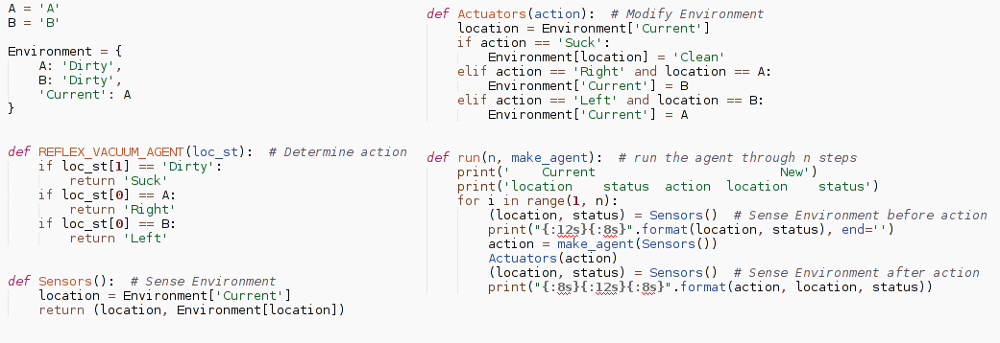
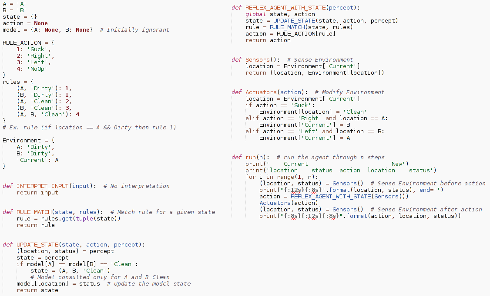

# Lab 1

This is my solutions to exercise lab 1 in the course Artificial Intelligence at SDU on fourth semester of Software Engineering.

## Homework 1: Reflex vacuum agent

To be submitted

Extend the reflex-vacuum-agent program to have 4 locations(4 squares):

- The agent should only sense and act on the square where it is located.
- Allow any starting square.
- Use run(20) to test and display results.

## Homework 2: Reflex vacuum agent with state

To be submitted

Extend the reflex vacuum agent with state program to have 4 locations(4 squares):

- The agent should only sense and act on the square where it is located
- Allow any starting square.
- Use run(20) to test and display results
